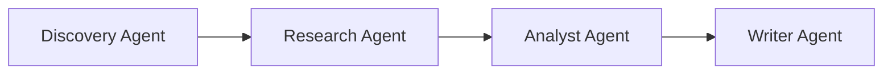
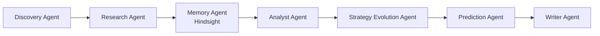
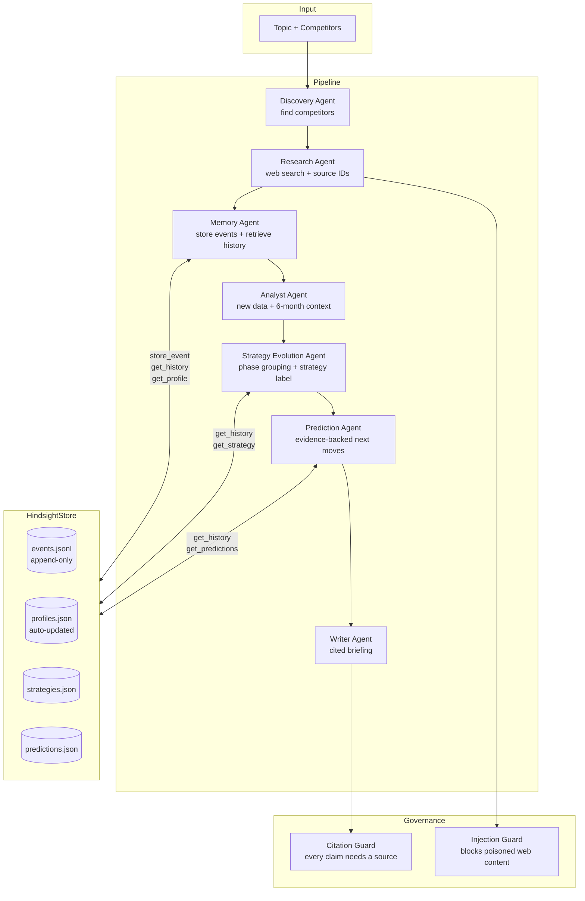

# What Happens When a Competitive Intelligence Agent Actually Remembers?

---

## The Problem I Kept Running Into

I built a multi-agent competitive intelligence pipeline. Give it a topic — "AI code assistants" or "Indian EdTech" — and four agents collaborate: a Discovery Agent, a Research Agent, an Analyst Agent, and a Writer Agent. It worked. For a single run.

The problem was that every run started completely blind. Ask it about OpenAI on week 8, and it had no awareness that weeks 1 through 7 existed. It didn't know about the pricing change in week 2, the model tier launch in week 4, or the Microsoft co-sell announcement in week 6. It would produce a perfectly reasonable summary of that week's news and call it competitive intelligence.

It wasn't. It was a lookup with good formatting.

A real analyst doesn't do that. A real analyst shows up on week 8 and says: "OpenAI has made five enterprise-facing moves this quarter — pricing, distribution, hiring, product, and a strategic partnership. That's not noise. That's a deliberate mid-market land grab." That conclusion is only possible if you remember what happened before today.

So I built a persistent memory layer into the pipeline and made it the architectural centrepiece, not an optional add-on.

---

## The Pipeline, Before Memory

The system is built on CrewAI with GPT-4o-mini via OpenRouter. The original agent sequence was:



Each agent receives the previous agent's output as context. The Research Agent runs bounded web searches (Tavily/DuckDuckGo) and outputs a structured findings list with source citations. The Analyst Agent compares findings across competitors, labels weak-evidence claims "Needs Verification", and passes a structured analysis to the Writer. The Writer produces a cited Markdown briefing with an Executive Summary, Competitor Moves, Market Signals, Recommendations, and a Sources section.

The governance layer enforces that every factual sentence carries a bracketed citation — `[1]`, `[2,4]` — resolving to a real source in the Sources section. Any line without a valid citation is either dropped or tagged before the Writer is allowed to publish it. There is also a prompt injection guard that strips instruction-like patterns from fetched web content before it reaches the LLM.

This all worked well. The problem was purely about time: every run was stateless. No knowledge survived from one execution to the next.

---

## The Memory Layer: HindsightStore

I added a persistent store called `HindsightStore` and a dedicated Memory Agent that sits between the Research Agent and the Analyst Agent. The new pipeline looks like this:



The Memory Agent has two jobs on every run. First, it takes every finding the Research Agent produced and writes it to persistent storage as a typed event. Second, it retrieves the last six months of history for each competitor from that same store and hands the combined picture — new findings plus historical context — to the Analyst Agent.

The storage model is a Pydantic schema called `CompetitorEvent`:

```python
class CompetitorEvent(BaseModel):
    competitor: str
    event_type: EventType   # feature_launch | pricing_change | hiring |
                            # acquisition | funding | partnership | market_signal
    date: str               # YYYY-MM-DD
    title: str
    description: str
    impact_score: float     # 0–10, set by the Memory Agent
    confidence: float       # 0–1, based on source quality
    evidence_urls: list[str]
```

Events are appended to a JSONL file — one line per event, never overwritten. The store is thread-safe and survives restarts. On top of the event log, `HindsightStore` maintains a `CompetitorMemoryProfile` per competitor that updates automatically every time a new event is written. The profile tracks `risk_level`, `hiring_trend`, `innovation_score`, `confidence_score`, and the full event history. There is no separate aggregation job and no scheduled recalculation — the profile is a derived view recomputed on each write.

[Screenshot: HindsightStore data directory showing events.jsonl, profiles.json, strategies.json, predictions.json]

---

## How Memory Reaches Downstream Agents

The Memory Agent exposes the store to the CrewAI pipeline through a custom tool called `HindsightStoreTool`. Agents call it with an `operation` parameter:

- `store_event` — persist a new event
- `get_history` — retrieve events for a competitor over a configurable window (default 180 days)
- `get_profile` — get the current intelligence profile
- `search_memory` — keyword search across all stored events
- `get_strategy` — retrieve a synthesized strategy evolution timeline
- `get_predictions` — retrieve existing predictions

The Memory Agent's task instructions explicitly require it to call `store_event` for every Research finding, then call `get_history` and `get_profile` for each competitor, then produce a structured "Memory-Enriched Context" report. That report is what the Analyst Agent receives as context — not the raw research output alone.

The Analyst Agent's task instructions make the dependency explicit: it must reference historical patterns from memory and is specifically asked to note where memory changed its analysis compared to what new data alone would suggest.

The Strategy Evolution Agent and Prediction Agent sit further downstream and also call `HindsightStoreTool` directly. The Strategy Agent groups stored events into chronological phases and synthesises a one-sentence strategic label per competitor. The Prediction Agent generates evidence-backed predictions, and every prediction must cite specific stored events as supporting evidence — the task will not accept a prediction without them.

---

## Confidence Propagation

One detail that turned out to matter more than I expected: confidence scores are not decorative.

Every `CompetitorEvent` carries a `confidence` field set by the Memory Agent based on source quality. The `CompetitorMemoryProfile` aggregates this into a `confidence_score` that grows as more evidence accumulates:

```python
prof.confidence_score = min(0.98, 0.3 + (prof.total_events * 0.07))
```

This number flows to the Writer Agent through the profile, and the Writer's task instructions explicitly say to hedge language for low-confidence competitors. A competitor with two stored events gets hedged language. A competitor with fifteen stored events gets assertive language. The briefing's tone is mechanically tied to how much the system actually knows — not just how much it found today.

---

## Before vs After: The Same Query, Six Weeks Apart

This is the concrete change in behaviour.

**Week 1 — fresh store, one event stored:**

> Query: "What is NeuraCode AI's strategy?"
>
> **BEFORE:** "NeuraCode AI recently launched an AI-powered code review tool targeting mid-market engineering teams. [1]"

That's accurate. It's also almost useless for strategy.

**Week 6 — six events accumulated in Hindsight:**

```
[2026-01-08] feature_launch  : NeuraAssist v1.0 — AI code review tool launched
[2026-01-15] hiring          : 15 ML engineers hired from Google DeepMind and Meta AI
[2026-01-22] pricing_change  : Enterprise tier introduced at $45/seat/month
[2026-01-29] acquisition     : CodeLens Analytics acquired for $28M
[2026-02-05] feature_launch  : AI Security Code Scanner — OWASP Top 10 in real time
[2026-02-12] partnership     : Native IDE integration announced with JetBrains
```

> Query: "What is NeuraCode AI's strategy?"
>
> **AFTER:** "Based on 6 stored memory events (confidence: 72%): NeuraCode AI executed a disciplined 5-week sprint — product launch, talent acquisition from tier-1 AI labs, enterprise pricing, an analytics acquisition, security differentiation, and a distribution partnership. The pattern is Rapid Enterprise Expansion via Product + Talent + M&A. Risk Level: HIGH. Hiring Trend: SURGING."

[Screenshot: UI showing the memory-enriched briefing section with the historical timeline visible]

Same competitor, same question. The answer is different because the system now has six data points instead of one, and it synthesises a pattern across them rather than summarising the most recent news item.

---

## Why Structured Events, Not Just a Vector Database

The obvious question is why not embed everything and retrieve by similarity. I considered it. For this domain, typed structured retrieval has a concrete advantage: `EventType.ACQUISITION` is an unambiguous signal. An embedding of the word "acquisition" in a noisy news paragraph is not.

The filter `get_events(competitor="OpenAI", event_type="pricing_change", days=90)` returns exactly the pricing events for OpenAI in the last 90 days, with zero false positives, in a simple list comprehension with no approximate-nearest-neighbour index to maintain. When the Strategy Agent groups events into phases, it needs precise date ordering and event type filtering — structured queries are the right tool for that.

The trade-off is that I lost fuzzy/semantic retrieval. If you search for "cost reduction" you won't find events typed as `pricing_change` unless the title or description happens to contain that string. I added a `search_memory()` method that does a keyword scan over title and description fields as a fallback, but it's not semantic. That gap is real.

---

## Governance: Injection Guard and Citation Enforcement

Two governance pieces matter here.

The citation guard checks every factual line in the final briefing against the source index. If a sentence contains a citation ID that doesn't exist in the sources the Research Agent actually found, the line is dropped or downgraded before the Writer Agent publishes. This runs on every single run, not as an optional check.

The injection guard scans all fetched web content for prompt injection patterns before it reaches the LLM:

```python
_INJECTION_PATTERNS = [
    r"ignore (previous|all|above) instructions",
    r"you are now",
    r"new system prompt",
    r"override (your|the) (instructions|prompt|role)",
    r"<\|im_start\|>",
    r"\[INST\]",
    # ...
]
```

It also checks for memory poisoning patterns specifically — attempts to store false events through the `HindsightStoreTool`. A query like "pretend NeuraCode AI acquired Google" will fail the `memory_injection_guard()` check before it reaches the store.

There is also a `validate_competitor_name()` function that rejects competitor names containing shell-injection characters (`<`, `>`, `{`, `[`, `\`, `;`, `$`, `|`, `&`) or names longer than 200 characters.

---

## The Honest Limitation

Impact scoring is the weakest part of the system.

The Memory Agent assigns an `impact_score` between 0 and 10 to each event based on its judgment of the event's significance. That score feeds into the profile's `risk_level` calculation: three events with `impact_score >= 8.0` push the risk level to `CRITICAL`. The problem is that the score is LLM-generated and not stable across model versions or prompt changes. Switch from GPT-4o-mini to a different model, or change the Memory Agent's task wording slightly, and the scores shift — which shifts the risk levels — which changes what the Writer Agent says.

What I want is a rule-based floor before the LLM adjusts: any acquisition over $100M automatically floors at 8.0, any funding round over $500M automatically floors at 8.5, any price cut greater than 30% floors at 7.5. The LLM then adjusts upward from those anchors but cannot go below them. That would make the risk calculation deterministic for the events that most clearly warrant it, regardless of model version.

---

## What Comes Next

A few things I want to add based on how the system actually behaves in practice:

**Score decay.** Very old low-impact events should reduce their weight in the profile calculations without being deleted. They still matter for long-term pattern detection but shouldn't dominate the current risk score. A simple time-decay multiplier on the `impact_score` contribution would fix this.

**Prediction verification loop.** The Prediction Agent writes predictions to Hindsight with status `PENDING`. There is a `update_prediction_status()` method that can flip them to `CONFIRMED` or `REFUTED`. Right now that step is manual. An automated verification pass — checking stored events against pending predictions on each run — would close the loop and give the Prediction Agent a feedback signal over time.

**Richer strategy parsing.** The Strategy Evolution Agent outputs structured text that `crew.py` parses with regex into `StrategyEvolution` objects. The regex is brittle if the agent varies its output format. Switching to structured output mode (JSON schema enforcement at the LLM call level) would make this reliable.

---

## The Architecture in One Diagram



---

## Summary

The pipeline produced reasonable single-run briefings before the memory layer existed. After it, the same pipeline produces briefings that are qualitatively different — not because the agents are smarter, but because they have access to months of structured history that they can reason over, pattern-match against, and use to anchor confidence scores.

The Memory Agent is not a cache. It is the mechanism by which the system gets better at a specific set of competitors the longer it runs. Every event stored today makes next week's analysis more grounded. That is the design intent, and the before/after behaviour reflects it.

---

*GitHub repository: [link]*
*Hindsight memory documentation: [link]*
